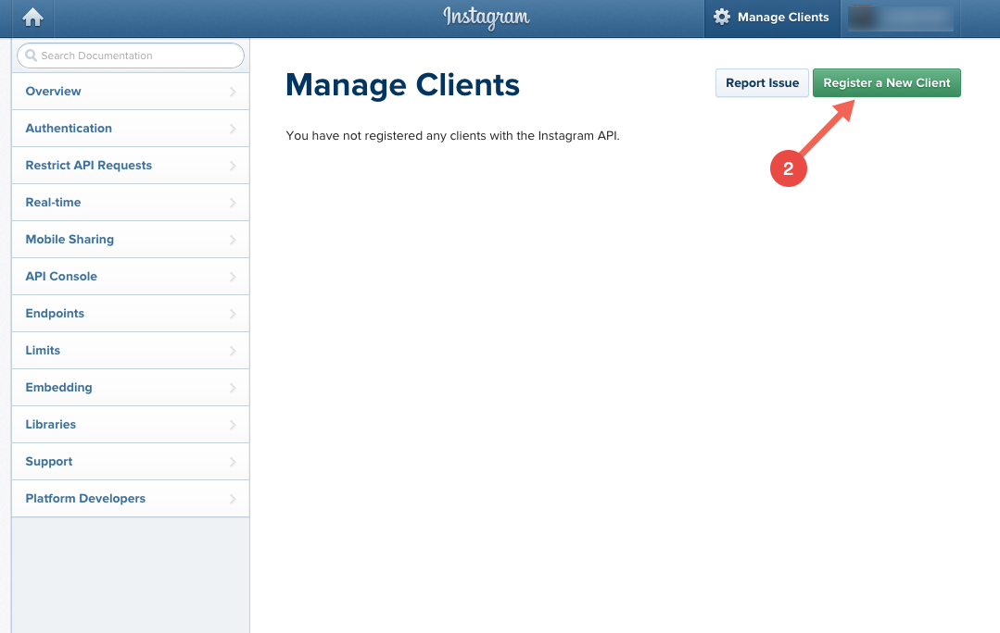

Integrate Salesforce into your application via the Cloud Elements APIs.  Review the following documentation for instructions on creating a new connected app in Salesforce, creating an instance, events, and more.

__Represented as a tree-like structure:__

```
|-- hykes
  |-- Command-line Layer
  |-- Ansible Layer
  |-- Server Layer
```

---



## Command-line Layer

Highest-order layer which provides means to perform all regular cloud operations via a simple CLI.
__Zero Ansible or Server layer knowledge required.__

__[Read the docs &raquo;](command-line.html)__

## Ansible Layer

Composes Server layer operations into higher-order cloud operations and concerns. __Deep knowledge
of Ansible; zero knowledge of Server layer required.__

__[Read the docs &raquo;](ansible.html)__

## Server Layer

Lowest-order layer which does all heavy lifting, including kernels, custom compilation, daemons,
CLIs, lifecycle systems, deployers, and other low-level concerns. __Deep knowledge of Linux, the
Cloud Elements platform, hardware, software, and more required.__

__[Read the docs &raquo;](server.html)__

## Hardware Requirements

All servers are assumed to have Ubuntu 14.04 LTS freshly installed, a static IP assigned, desired
hostname configured, and at least one non-root admin account to perform all operations. A single
virtual IP is needed for a high-availability load balancer setup.

#### Minimum:

```
|-- all
  |-- 1x app (2 vCPU, 8GB RAM, 32GB HDD)
  |-- 1x cache (1 vCPU, 4GB RAM, 32GB HDD)
  |-- 1x database (2 vCPU, 8GB RAM, 64GB SSD)
  |-- 1x eib (1 vCPU, 2GB RAM, 32GB SSD)
  |-- 1x loadbalance (1 vCPU, 1GB RAM, 32GB HDD)
  |-- 1x logpipe (1 vCPU, 2GB RAM, 32GB HDD)
  |-- 1x logsearch (1 vCPU, 4GB RAM, 64GB HDD)
```

---

#### Recommended:

```
|-- all
  |-- 3x app (4 vCPU, 8GB RAM, 64GB SSD)
  |-- 2x cache (1 vCPU, 4GB RAM, 64GB SSD)
  |-- 2x database (4 vCPU, 16GB RAM, 96GB SSD)
  |-- 2x eib (1 vCPU, 4GB RAM, 64GB SSD)
  |-- 2x loadbalance (1 vCPU, 2GB RAM, 64GB SSD)
  |-- 2x logpipe (2 vCPU, 4GB RAM, 32GB SSD)
  |-- 3x logsearch (2 vCPU, 8GB RAM, 96GB SSD)
```

---

## Firewall Requirements

Software firewalls (i.e. iptables) are used to provide baseline protection. Hardware firewalls
can be used in addition to, or in lieu of, software firewalls, providing the following rules
are met:

#### Inbound:

```
|-- all (22 open to public)
  |-- app (8080 open to app/loadbalance)
  |-- cache (6379/11211 open to app/cache)
  |-- database (5432 open to app/database)
  |-- eib (2181/9092 open to app/eib)
  |-- loadbalance (80/443 open to public, 9200 open to app/loadbalance)
  |-- logpipe (none)
  |-- logsearch (9200/9300 open to logpipe/logsearch/loadbalance)
```

---

## DNS Requirements

#### Public endpoints:

| Record                  | Required | Example             | Purpose
| ----------------------- | -------- | ------------------- | -------
| `{{base_fqdn}}`         | No       | example.com         | Redirect `{{base_fqdn}}` traffic to `console.{{base_fqdn}}`
| `api.{{base_fqdn}}`     | Yes      | api.example.com     | REST endpoint
| `console.{{base_fqdn}}` | Yes      | console.example.com | UI endpoint

> __NOTE:__ All public endpoint records should point to the IP of `loadbalance[0]`

---

#### Server lookup:

| Record                         | Required | Example
| ------------------------------ | -------- | ------------------------
| `app[n].{{base_fqdn}}`         | Yes      | app0.example.com
| `cache[n].{{base_fqdn}}`       | Yes      | cache0.example.com
| `database[n].{{base_fqdn}}`    | Yes      | database0.example.com
| `eib[n].{{base_fqdn}}`         | Yes      | eib0.example.com
| `loadbalance[n].{{base_fqdn}}` | Yes      | loadbalance0.example.com
| `logpipe[n].{{base_fqdn}}`     | Yes      | logpipe0.example.com
| `logsearch[n].{{base_fqdn}}`   | Yes      | logsearch0.example.com

> __NOTE:__ All server lookup records should point to the IP of the server the record refers to

---

## Certificate Requirements

TLS/SSL certificates are required to protect all [public endpoints](#public-endpoints). This can be
accomplished via one of three approaches:

#### Via Wildcard Certificate

* Wildcard certificate for `{{base_fqdn}}`

#### Via SAN Certificate

* SAN certificate for `api.{{base_fqdn}}`, `console.{{base_fqdn}}`, and optionally `{{base_fqdn}}`
(see [public endpoints](#public-endpoints) for details)

#### Via Single Certificates

* Single certificate for `api.{{base_fqdn}}`
* Single certificate for `console.{{base_fqdn}}`
* Optionally, single certificate for `{{base_fqdn}}` (see [public endpoints](#public-endpoints)
for details)
