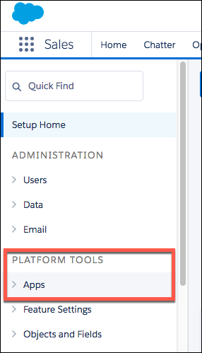
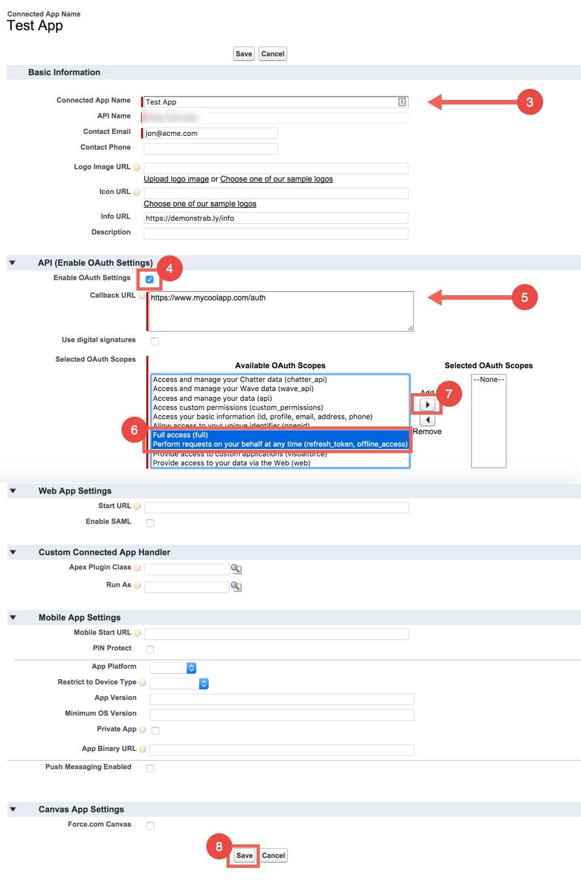

## Enpoint Setup

Follow these steps to setup your Salesforce application with the endpoint.

__In order to create a Salesforce Element Instance you must have the Enterprise edition or Professional edition with API support is required. Also, to set up a new application in Salesforce, you must have Administrator privileges. Please contact your system administrator if you do not have those privileges.__

Via a web browser, login to your Salesforce account:
[https://login.salesforce.com/](https://login.salesforce.com/)


Select "Setup" if not taken there by default:

1. In left hand nav menu, under create, select "Apps"
2. Click "New" 
3. Fill out the basic information about the app
4. Make sure to select "Enable OAuth Settings"
5. You’ll be required to enter a callback URL from the endpoint. This URL will be in your application’s address space, and you will be required to retrieve some information returned on this URL by the endpoint. For our example,we’ll use a callback URL of https://mycoolapp.com/auth
6. Choose from the "Selected OAuth Scopes". "Full Access" and "Perform requests on your behalf at any time (refresh_token_, offline_access)" are the minimum needed scopes.
7. Add the selected scopes
8. Click "Save" at the bottom of the window 
9. Please make a note of the "Consumer Key"
10. Please make a note of the "Consumer Secret" 

---

## Create Instance

Salesforce is a Customer Success Platform. When you provision an instance, your app will have access to the different functionality offered by the Salesforce platform.

Optionally, you may provision an instance to specific features like Marketing Cloud, Service Cloud and Salesforce Documents. Below are examples of each method.

### Get Elements OAuth Information

HTTP Header: None
HTTP Verb: GET
Request URL: /elements/{key}/oauth/url
Request Body: None
Query Parameters:

* __apiKey–__ the key obtained from registering your app with the provider
* __apiSecret__ – the secret obtained from registering your app with the provider
* __callbackUrl__ – the URL that you supplied to the provider when registering your app, state – any custom value that you want passed to the callback handler listening at the provided callback URL.

Description: The result of this API invocation is an OAuth redirect URL from the endpoint. Your application should now redirect to this URL, which in turn will present the OAuth authentication and authorization page to the user. When the provided callback URL is executed, a code value will be returned, which is required for the Create Instance API.

Example cURL Command:

```
curl -X GET
-H 'Content-Type: application/json'
'https://api.cloud-elements.com/elements/api-v2/elements/sfdc/oauth/url?apiKey=fake_salesforce_api_key&apiSecret=fake_salesforce_api_secret&callbackUrl=https://www.mycoolapp.com/auth&state=sfdc'
```

Response:

```
{
"element": "sfdc",
"oauthUrl": "https://login.salesforce.com/services/oauth2/authorize?response_type=code&client_id=fake_salesforce_api_key&client_secret=xyz789&scope=full%20refresh_token&redirect_uri=https://www.mycoolapp.com/auth&state=sfdc"
}
```

Handle Callback from the Endpoint:
Upon successful authentication and authorization by the user, the endpoint will redirect to the callback URL you provided when you setup your application with the endpoint, in our example, https://www.mycoolapp.com/auth. The endpoint will also provide two query string parameters: “state” and “code”. The value for the “state” parameter will be the name of the endpoint, e.g., “sfdc” in our example, and the value for the “code” parameter is the code required by Cloud Elements to retrieve the OAuth access and refresh tokens from the endpoint. If the user denies authentication and/or authorization, there will be a query string parameter called “error” instead of the “code” parameter. In this case, your application can handle the error gracefully.

### Create an Instance

To provision your Salesforce Element, use the /instances API.

Below is an example of the provisioning API call.

* __HTTP Headers__: Authorization- User <user secret>, Organization <organization secret>
* __HTTP Verb__: POST
* __Request URL__: /instances
* __Request Body__: Required – see below
* __Query Parameters__: none

Description: An Element token is returned upon successful execution of this API. This token needs to be retained by the application for all subsequent requests involving this element instance.

A sample request illustrating the /instances API is shown below.

HTTP Headers:

```
Authorization: User <INSERT_USER_SECRET>, Organization <INSERT_ORGANIZATION_SECRET>

```
This instance.json file must be included with your instance request.  Please fill your information to provision.  The “key” into Cloud Elements Salesforce is “sfdc”.  This will need to be entered in the “key” field below depending on which Element you wish to instantiate.

```
{
  "element": {
    "key": "sfdc"
  },
  "providerData": {
    "code": "<Code_On_The_Return_URL>"
  },
  "configuration": {
    "oauth.callback.url": "https://www.mycoolapp.com/auth",
    "oauth.api.key": "<Insert_Client_ID>",
    "oauth.api.secret": "<Insert_Client_Secret>"
  },
  "tags": [
    "<Add_Your_Tag>"
  ],
  "name": "<Insert_Instance_Name>"
}
```

Here is an example cURL command to create an instance using /instances API.

Example Request:

```
curl -X POST
-H 'Authorization: User <INSERT_USER_SECRET>, Organization <INSERT_ORGANIZATION_SECRET>'
-H 'Content-Type: application/json'
-d @instance.json
'https://api.cloud-elements.com/elements/api-v2/instances'
```

If the user does not specify a required config entry, an error will result notifying her of which entries she is missing.

Below is a successful JSON response:

```
{
    "id": 123,
    "name": "test",
    "token": "3sU/S/kZD36BaABPS7EAuSGHF+1wsthT+mvoukiE",
    "element": {
        "id": 39,
        "name": "Salesforce.com",
        "key": "sfdc",
        "description": "The Salesforce.com allows you to deliver revolutionary CRM automation functionality, such as account and contact creation, from anywhere, anytime, on any device.",
        "active": true,
        "deleted": false,
        "typeOauth": true,
        "trialAccount": false,
        "configDescription": "If you do not have a Salesforce.com account, you can create one at <a href="http://www.salesforce.com" target="_blank">Salesforce.com Signup</a>",
        "signupURL": "http://www.salesforce.com"
    },
    "provisionInteractions": [],
    "valid": true,
    "eventsEnabled": true,
    "disabled": false,
    "maxCacheSize": 0,
    "cacheTimeToLive": 0,
    "cachingEnabled": false
}
```

Note:  Make sure you have straight quotes in your JSON files and cURL commands.  Please use plain text formatting in your code.  Make sure you do not have spaces after the in the cURL command.

---

## Events

Cloud Elements supports both webhook and polling events for Salesforce.

### Polling

In order to enable polling, add these two extra configurations to your instance JSON:

```
"event.notification.enabled": "true",
"event.notification.callback.url": "<INSERT_YOUR_APPS_CALLBACL_URL>"
```

instance JSON with polling events enabled:

```
{
  "element": {
    "key": "sfdc"
  },
  "providerData": {
    "code": "<Code_On_The_Return_URL>"
  },
  "configuration": {
    "oauth.callback.url": "https://www.mycoolapp.com/auth",
    "oauth.api.key": "<Insert_Client_ID>",
    "oauth.api.secret": "<Insert_Client_Secret>",
    "event.notification.enabled": "true",
    "event.notification.callback.url": "<INSERT_YOUR_APPS_CALLBACL_URL>"
  },
  "tags": [
    "<Add_Your_Tag>"
  ],
  "name": "<Insert_Instance_Name>"
}
```

### Webhooks


### Bulk APIs

Cloud Element Bulk API calls provide an option to upload a large number of resources, such as contacts, into a Cloud Service all at once.

The Bulk APIs require the name of the object identified within the cloud service and a .csv file with populated data included in each request.

Cloud Elements provides discovery services to get a list of available objects.

First we will make the GET /objects call to retrieve a list of available objects

```
curl -X GET
-H 'Authorization: Element <INSERT ELEMENT TOKEN>, User <INSERT_USER_SECRET>'
'https://api.cloud-elements.com/elements/api-v2/hubs/marketing/objects'
```

Example of Successful Response:

```
[
  "activities",
  "contact",
  "campaign",
  "list",
  "account"
]
```

The “contact” object is available. We will use contact in our bulk upload. It will be placed in our request URL.

A csv file with populated data is required in our request, like the one seen below.

Example data will be used in this demonstration.


An Example request can be seen below.:

```
curl -X POST
-H 'Authorization: Element <INSERT ELEMENT TOKEN>, User <INSERT_USER_SECRET>'
-F file=@sample.csv
'https://api.cloud-elements.com/elements/api-v2/hubs/marketing/bulk/contact?path=/sample.csv'
```
Example of Successful Response:

```
{
  "id": "1234",
  "status": "CREATED"
}
```

An id is assigned to job. This can be used to check the status of a bulk job.

The id “1234” will be used in the request URL in the next example.

```
curl -X GET
-H 'Authorization: Element <INSERT ELEMENT TOKEN>, User <INSERT_USER_SECRET>'
'https://api.cloud-elements.com/elements/api-v2/hubs/marketing/bulk/1234/status'
```
Example of Successful Response:

```
{
  "id": "1234",
  "status": "COMPLETE"
}
```

Once the job is completed, login to the cloud service an find your newly created contacts.
