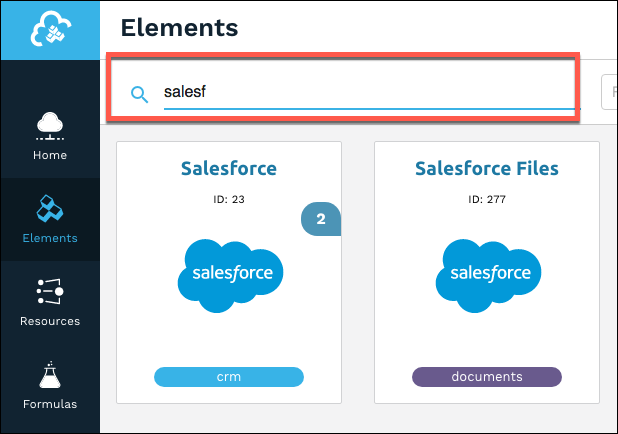
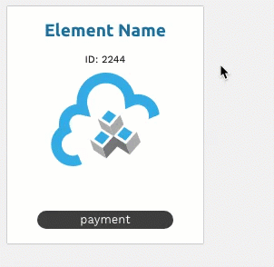

# Authenticate with Salesforce

You can authenticate with Salesforce to create your own instance of the {{page.heading}} element through the {{site.console}} or through APIs. Once authenticated, you can use the element instance to access the different functionality offered by the {{page.heading}} platform.



## Authenticate Through the UI

Use the {{site.console}} to authenticate with Salesforce and create an element instance.

1. Sign in, and then search for the element in our Elements Catalog.

    | Latest UI | Earlier UI  |
    | :------------- | :------------- |
    |    |    |

3. Create an element instance.

    | Latest UI | Earlier UI  |
    | :------------- | :------------- |
    | Hover over the element card, and then click __Create Instance__.</br>   | Click __Add Instance__.</br>   |

5. Enter a name for the element instance.
6. Complete the Instance Configuration parameters. See [Parameters](#parameters) for information about each parameter.

      

7. Click __Create Instance__ (latest UI) or __Next__ (earlier UI).
8. Optionally add tags in the earlier UI:
     1. On the Tag It page, enter any tags that might help further define the instance.
      * To add more than one tag, click __Add__ after each tag.
      
     1. Click __Done__.
8. Provide your Salesforce credentials, and then allow the connection.
8. Take a look at the documentation for the element resources now available to you.

## Authenticate Through API

Use the `/instances` endpoint to authenticate with {{page.heading}} and create an element instance.

__Note__: An Element token is returned upon successful execution of this API. Retain the token for all subsequent requests involving this element instance.

The `/instances` API call includes:

* __HTTP Headers__: Authorization- User <user secret>, Organization <organization secret>
* __HTTP Verb__: POST
* __Request URL__: /instances
* __Request Body__: Required – see below
* __Query Parameters__: none

### Request Body

You must include a JSON body with your `/instances` request.  See [Parameters](#parameters) for information about each parameter. The Boolean parameters show default values.

__Note__: If you don't specify a required parameter, your response results in an error.

__Note__: The following example JSON show webhooks enabled. You can also enable polling which requires a more detailed configuration. See [Events](events.html) for more information.

```json
{
  "element": {
    "key": "woocommercerest"
  },
  "configuration": {
	"store.url": "<http://mycoolstore.com>",
	"oauth.api.key": "<CONSUMER_KEY>",
	"oauth.api.secret": "<CONSUMER_SECRET>",
	"filter.response.nulls": true,
	"event.vendor.type": "webhook",
	"event.notification.callback.url": "http://mycoolstore.com",
  "event.notification.signature.key": "123456"
  },
  "tags": [
	"Docs"
  ],
  "name": "ConcurForDocs"
}
```

## Parameters

API parameters are in `code formatting`.

| Heading | Heading   | Data Type |
| :------------- | :------------- | :------------- |
| 'key' | The element key.<br>sfdc  | string  |
|  Name</br>`name` |  The name for the element instance created during authentication.   | Body  |
| `oauth.api.key` |  |  string |
| `oauth.api.secret` |  | string |
| Filter null values from the response </br>`filter.response.nulls` | *Optional*. Determines if null values in the response JSON should be filtered from the response. Yes or `true` indicates that Cloud Elements will filter null values. </br>Default: `true`.  | boolean |
| Events Enabled </br>`event.notification.enabled` | *Optional*. Identifies that events are enabled for the element instance.</br>Default: `false`  | boolean |
| Event Type </br>`event.vendor.type` | *Optional*. identifies the type of events enabled for the instance, either `webhook` or `polling`. | string |
| Event Notification Callback URL</br>`event.notification.callback.url` |  *For webhooks and polling.*</br>The URL that you supplied to the provider when registering your app, state – any custom value that you want passed to the callback handler listening at the provided callback URL. | string |
| Event Notification Signature Key </br>`event.notification.signature.key` | *For webhooks and polling.*</br>*Optional*</br>A user-defined key for added security to show that events have not been tampered with. | string |
| Objects to Monitor for Changes</br>`event.objects`|  *For webhooks and polling.*</br>*Optional*</br>A user-defined key for added security to show that events have not been tampered with. | string |
| Event poller refresh interval (mins)</br>`event.poller.refresh_interval`  | *For polling only.*</br>A number in minutes to identify how often the poller should check for changes. |  number|
| tags | *Optional*. User-defined tags to further identify the instance. | string |

## Sample Request

Below is an example cURL request:

```
curl -X POST  \
 -H 'Authorization: User <INSERT>, Organization <INSERT>'  \
 -H 'Content-Type: application/json'  \
 --data '{ \
  "name": "<ELEMENT_INSTANCE_NAME>", \
  "configuration": { \
    "filter.response.nulls": "true", \
    "event.vendor.type": "webhook", \
    "event.notification.enabled": true, \
    "store.url": "http://<URL>", \
    "oauth.api.key": "<CONSUMER_KEY>", \
    "oauth.api.secret": "<CONSUMER_SECRET>", \
    "event.notification.callback.url": ""<INSERT_YOUR_APPS_CALLBACK_URL>", \
    "event.notification.signature.key": "12345" \
  } \
}'  \
'https://api.cloud-elements.com/elements/api-v2/elements/2881/instances'
```


Note that Salesforce allows multiple environments, such as production and sandbox environments. If you would like to connect to an alternate environment, change the endpoint address.

### Step 1. Get Elements OAuth Information

* HTTP Header: None
* HTTP Verb: GET
* Request URL: /elements/{keyOrId}/oauth/url
* Request Body: None
* Query Parameters:

* __apiKey–__ the key obtained from registering your app with the provider
* __apiSecret__ – the secret obtained from registering your app with the provider
* __callbackUrl__ – the URL that you supplied to the provider when registering your app, state – any custom value that you want passed to the callback handler listening at the provided callback URL.

Description: The result of this API invocation is an OAuth redirect URL from the endpoint. Your application should now redirect to this URL, which in turn will present the OAuth authentication and authorization page to the user. When the provided callback URL is executed, a code value will be returned, which is required for the Create Instance API.

Example cURL Command:

```bash
curl -X GET
-H 'Content-Type: application/json'
'https://api.cloud-elements.com/elements/api-v2/elements/sfdc/oauth/url?apiKey=fake_salesforce_api_key&apiSecret=fake_salesforce_api_secret&callbackUrl=https://www.mycoolapp.com/auth&state=sfdc'
```

Response:

```json
{
"element": "sfdc",
"oauthUrl": "https://login.salesforce.com/services/oauth2/authorize?response_type=code&client_id=fake_salesforce_api_key&client_secret=xyz789&scope=full%20refresh_token&redirect_uri=https://www.mycoolapp.com/auth&state=sfdc"
}
```

Handle Callback from the Endpoint:
Upon successful authentication and authorization by the user, the endpoint will redirect to the callback URL you provided when you setup your application with the endpoint, in our example, https://www.mycoolapp.com/auth. The endpoint will also provide two query string parameters: “state” and “code”. The value for the “state” parameter will be the name of the endpoint, e.g., “sfdc” in our example, and the value for the “code” parameter is the code required by Cloud Elements to retrieve the OAuth access and refresh tokens from the endpoint. If the user denies authentication and/or authorization, there will be a query string parameter called “error” instead of the “code” parameter. In this case, your application can handle the error gracefully.

### Step 2. Create an Instance

To provision your Salesforce Element, use the /instances API.

Below is an example of the provisioning API call.

* __HTTP Headers__: Authorization- User <user secret>, Organization <organization secret>
* __HTTP Verb__: POST
* __Request URL__: /instances
* __Request Body__: Required – see below
* __Query Parameters__: none

Description: An Element token is returned upon successful execution of this API. This token needs to be retained by the application for all subsequent requests involving this element instance.

A sample request illustrating the /instances API is shown below.

HTTP Headers:

```bash
Authorization: User <INSERT_USER_SECRET>, Organization <INSERT_ORGANIZATION_SECRET>

```
This instance.json file must be included with your instance request.  Please fill your information to provision.  The “key” into Cloud Elements Salesforce is “sfdc”.  This will need to be entered in the “key” field below depending on which Element you wish to instantiate.

```json
{
  "element": {
    "key": "sfdc"
  },
  "providerData": {
    "code": "<Code_On_The_Return_URL>"
  },
  "configuration": {
    "oauth.callback.url": "https://www.mycoolapp.com/auth",
    "oauth.api.key": "<Insert_Client_ID>",
    "oauth.api.secret": "<Insert_Client_Secret>"
  },
  "tags": [
    "<Add_Your_Tag>"
  ],
  "name": "<Insert_Instance_Name>"
}
```

Here is an example cURL command to create an instance using /instances API.

Example Request:

```bash
curl -X POST
-H 'Authorization: User <INSERT_USER_SECRET>, Organization <INSERT_ORGANIZATION_SECRET>'
-H 'Content-Type: application/json'
-d @instance.json
'https://api.cloud-elements.com/elements/api-v2/instances'
```

If the user does not specify a required config entry, an error will result notifying her of which entries she is missing.

Below is a successful JSON response:

```json
{
    "id": 123,
    "name": "test",
    "token": "3sU/S/kZD36BaABPS7EAuSGHF+1wsthT+mvoukiE",
    "element": {
        "id": 39,
        "name": "Salesforce.com",
        "key": "sfdc",
        "description": "The Salesforce.com allows you to deliver revolutionary CRM automation functionality, such as account and contact creation, from anywhere, anytime, on any device.",
        "active": true,
        "deleted": false,
        "typeOauth": true,
        "trialAccount": false,
        "configDescription": "If you do not have a Salesforce.com account, you can create one at <a href="http://www.salesforce.com" target="_blank">Salesforce.com Signup</a>",
        "signupURL": "http://www.salesforce.com"
    },
    "provisionInteractions": [],
    "valid": true,
    "eventsEnabled": true,
    "disabled": false,
    "maxCacheSize": 0,
    "cacheTimeToLive": 0,
    "cachingEnabled": false
}
```

Note:  Make sure you have straight quotes in your JSON files and cURL commands.  Please use plain text formatting in your code.  Make sure you do not have spaces after the in the cURL command.

##### Marketing Cloud

Provision an instance to Marketing Cloud functions only. Use the following JSON, the key value (sfdcmarketingcloud instead of sfdc) is the only difference in the JSON in the first example.

```bash
curl -X GET
-H 'Content-Type: application/json'
'https://api.cloud-elements.com/elements/api-v2/elements/sfdc/oauth/url?apiKey=fake_salesforce_api_key&apiSecret=fake_salesforce_api_secret&callbackUrl=https://www.demonstrab.ly/home&state=sfdcmarketingcloud'
```

Response:

```bash
{
"element": "sfdcmarketingcloud",
"oauthUrl": "https://login.salesforce.com/services/oauth2/authorize?response_type=code&client_id=fake_salesforce_api_key&client_secret=xyz789&scope=full%20refresh_token&redirect_uri=https://www.demonstrab.ly/home&state=sfdc"
}
```
Create Instance JSON:

```json
{
  "element": {
    "key": "sfdcmarketingcloud"
  },
  "providerData": {
    "code": "<Code_On_The_Return_URL>"
  },
  "configuration": {
    "oauth.callback.url": "https://www.demonstrab.ly/home",
    "oauth.api.key": "<Insert_Client_ID>",
    "oauth.api.secret": "<Insert_Client_Secret>"
  },
  "tags": [
    "<Add_Your_Tag>"
  ],
  "name": "<Insert_Instance_Name>"
}
```

##### Service Cloud

Provision an instance to Service Cloud functions only. Use the following JSON, the key value (sfdcservicecloud instead of sfdc) is the only difference in the JSON in the first example.

```bash
curl -X GET
-H 'Content-Type: application/json'
'https://api.cloud-elements.com/elements/api-v2/elements/sfdcservicecloud/oauth/url?apiKey=fake_salesforce_api_key&apiSecret=fake_salesforce_api_secret&callbackUrl=https://www.demonstrab.ly/home&state=sfdcservicecloud'
```

Response:

```bash
{
  "element": "sfdcservicecloud",
  "oauthUrl": "https://login.salesforce.com/services/oauth2/authorize?response_type=code&client_id=fake_salesforce_api_key&client_secret=xyz789&scope=full%20refresh_token&redirect_uri=https://www.demonstrab.ly/home&state=sfdcservicecloud"
}
```
Create Instance JSON:

```json
{
  "element": {
    "key": "sfdcservicecloud"
  },
  "providerData": {
    "code": "<Code_On_The_Return_URL>"
  },
  "configuration": {
    "oauth.callback.url": "https://www.demonstrab.ly/home",
    "oauth.api.key": "<Insert_Client_ID>",
    "oauth.api.secret": "<Insert_Client_Secret>"
  },
  "tags": [
    "<Add_Your_Tag>"
  ],
  "name": "<Insert_Instance_Name>"
}
```

##### Documents

Provision an instance to Documents functions only. Use the following JSON, the key value (sfdcdocuments instead of sfdc) is the only difference in the JSON in the first example.

```bash
curl -X GET
-H 'Content-Type: application/json'
'https://api.cloud-elements.com/elements/api-v2/elements/sfdcdocuments/oauth/url?apiKey=fake_salesforce_api_key&apiSecret=fake_salesforce_api_secret&callbackUrl=https://www.demonstrab.ly/home&state=sfdcdocuments'
```

Response:

```bash
{
  "element": "sfdcservicecloud",
  "oauthUrl": "https://login.salesforce.com/services/oauth2/authorize?response_type=code&client_id=fake_salesforce_api_key&client_secret=xyz789&scope=full%20refresh_token&redirect_uri=https://www.demonstrab.ly/home&state=sfdcdocuments"
}
```
Create Instance JSON:

```json
{
  "element": {
    "key": "sfdcdocuments"
  },
  "providerData": {
    "code": "<Code_On_The_Return_URL>"
  },
  "configuration": {
    "oauth.callback.url": "https://www.demonstrab.ly/home",
    "oauth.api.key": "<Insert_Client_ID>",
    "oauth.api.secret": "<Insert_Client_Secret>"
  },
  "tags": [
    "<Add_Your_Tag>"
  ],
  "name": "<Insert_Instance_Name>"
}
```


