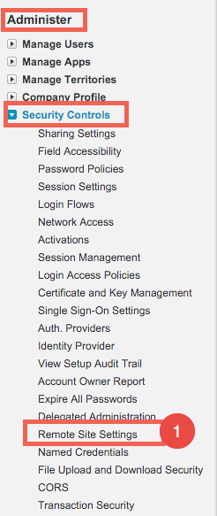

## Events



Cloud Elements supports both webhooks and polling events for Salesforce.

### Polling

In order to enable polling, add these two extra configurations to your instance JSON:

```
"event.notification.enabled": "true",
"event.notification.callback.url": "<INSERT_YOUR_APPS_CALLBACK_URL>",
"event.poller.urls": "<SEE_BELOW>"
```

instance JSON with polling events enabled:

```json
{
  "element": {
    "key": "sfdc"
  },
  "providerData": {
    "code": "<Code_On_The_Return_URL>"
  },
  "configuration": {
    "oauth.callback.url": "https://www.mycoolapp.com/auth",
    "oauth.api.key": "<Insert_Client_ID>",
    "oauth.api.secret": "<Insert_Client_Secret>",
    "event.notification.enabled": "true",
    "event.notification.callback.url": "<INSERT_YOUR_APPS_CALLBACK_URL>",
    "event.vendor.type": "polling",
    "event.objects": "<INSERT_OBJECTS_YOU_WISH_TO_POLL_SEPARATED_BY_A_|_>" // Account|Contact
  },
  "tags": [
    "<Add_Your_Tag>"
  ],
  "name": "<Insert_Instance_Name>"
}
```

### Webhooks

When implementing webhooks for Salesforce, Cloud Elements creates APEX classes and triggers in order to send webhooks.  This can only be done in a Salesforce sandbox account.  If you want to support webhooks in a production Salesforce account, you'll have to make some modifications and migrate those classes to production according to the Salesforce specification. View more information regarding the [Salesforce specification](https://developer.salesforce.com/docs/atlas.en-us.apexcode.meta/apexcode/apex_qs_deploy.htm).

Follow these steps to setup your Salesforce application with the endpoint.

__In order to create a Salesforce Element Instance you must have the Enterprise edition or Professional edition with API support is required. Also, to set up a new application in Salesforce, you must have Administrator privileges. Please contact your system administrator if you do not have those privileges.__

Via a web browser, login to your Salesforce account:
[https://login.salesforce.com/](https://login.salesforce.com/)


1. Under "Administer" > "Security Controls" > select "Remote Site Settings"


2. Click “New Remote Site”


3. Input “Remote Site Name” e.g. Cloud Elements and the following URL: `https://api.cloud-elements.com`

4. Click “Save”


__NOTE: Our current support for Salesforce Events include listening for the following:
Creating, Updating, and Deleting of any object in Salesforce.
For example, when a new account is created, your application will receive a notification regarding the creation of the account.__

The following JSON may be used to create a Salesforce Instance with webhooks enabled:

```json
{
  "element": {
    "key": "sfdc"
  },
  "providerData": {
    "code": "<Code_On_The_Return_URL>"
  },
  "configuration": {
    "oauth.callback.url": "https://www.mycoolapp.com/auth",
    "oauth.api.key": "<Insert_Client_ID>",
    "oauth.api.secret": "<Insert_Client_Secret>",
    "event.notification.enabled": "true",
    "event.notification.callback.url": "<INSERT_YOUR_APPS_CALLBACK_URL>",
    "event.vendor.type": "webhook",
    "event.objects": "<INSERT_COMMA_SEPARATED_LIST_OF_OBJECTS_e.g_Account,Contact>"
  },
  "tags": [
    "<Add_Your_Tag>"
  ],
  "name": "<Insert_Instance_Name>"
}
```
