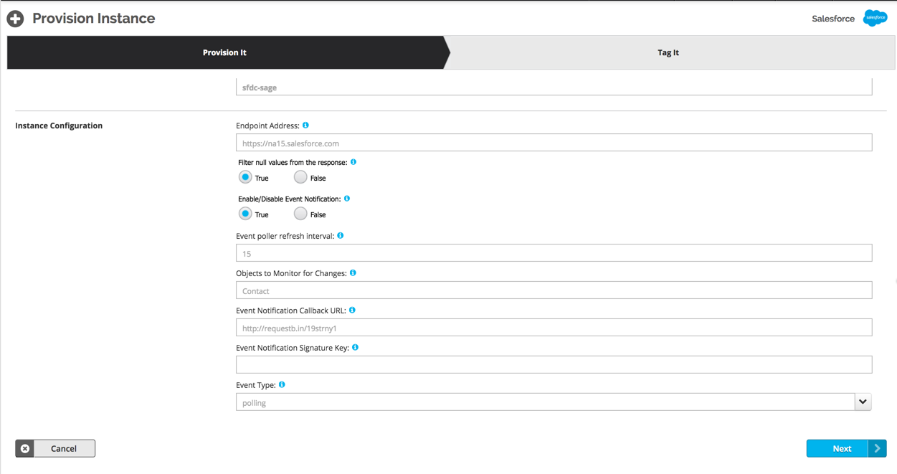
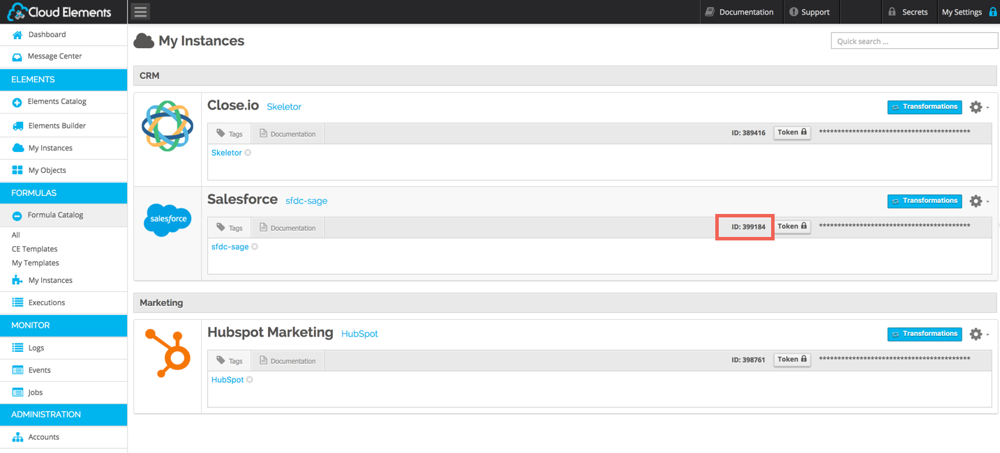
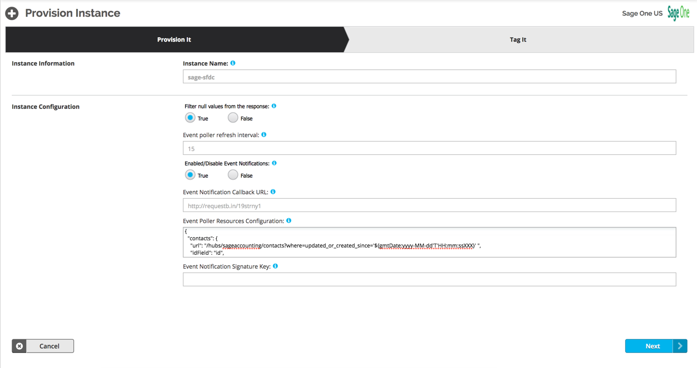

### Creating your first Integration

To help guide you through the Cloud Elements platform, we will build an example integration. Our use case will be to sync Contacts from Salesforce to Sage.

__NOTE:__ if you have not reviewed our [Definitions section](definitions.html), please do so before viewing this guide.

We will walk through the following steps in order to build this integration:

1. Create our Element Instances (Salesforce and Sage) with events enabled
2. Build a Formula to keep both systems in sync

#### Create Element Instances

Since our Integration will consist of Salesforce and Sage, we need to create Element Instances of both.

We will begin with Salesforce.

__In order to create a Salesforce Element Instance you must have the Enterprise edition or Professional edition with API support is required. Also, to set up a new application in Salesforce, you must have Administrator privileges. Please contact your system administrator if you do not have those privileges.__

View our [Salesforce Element Guide](/docs/elements/salesforce/) for information if applicable

From the Elements Catalog, find Salesforce in the CRM Hub and click Add Instance.

We will enable polling events on contacts.
You may leave the Event Notification Callback URL field blank since we are going to use a formula to sync this data.  A `requestbin` has been entered in the example.  This could be useful for testing or debugging.
NOTE:  Salesforce expects the objects you are polling for to be capitalized.
INPUT `Contact` in the object field of the instance configuration.


Complete the instance creation by authenticating into your Salesforce account.

You will see your instance successfully created in the list under My Instances.
Make note of the Instance ID as it will be needed in the formula.


Next we will create the Sage Instance.

NOTE: there is some additional setup to connect to Sage One US.  Please view our [Sage One Element Guide](/docs/elements/sageoneuse/) for information if applicable.

From the Elements Catalog, find Sage in the Sage Accounting Hub and click Add Instance.

We will enable polling events on contacts.
You may leave the Event Notification Callback URL field blank since we are going to use a formula to sync this data.  A `requestbin` has been entered in the example.  This could be useful for testing or debugging.

Input the following poller configuration for contacts:

```JSON
{
  "contacts": {
    "url": "/hubs/sageaccounting/contacts?where=updated_or_created_since='${gmtDate:yyyy-MM-dd'T'HH:mm:ssXXX}' ",
    "idField": "id",
    "datesConfiguration": {
      "updatedDateField": "updated_at",
      "updatedDateFormat": "yyyy-MM-dd HH:mm:ss",
      "updatedDateTimezone": "UTC",
      "createdDateField": "created_at",
      "createdDateFormat": "yyyy-MM-dd HH:mm:ss",
      "createdDateTimezone": "UTC"
    }
  }
}
```



Now that the Element Instances have been created, they can be accessed within our contact sync formula.

#### Formula Creation

In order to sync Salesforce and Sage contacts, a formula template will need to be built and then instantiated.  This template will need to reference the two Instances created in the previous step.

This guide will walk through the creation of the example integration.  If you would like more information about the different capabilities available please see our [Formula documentation](/docs/products/formulas/).

First from the left hand navigation menu in the console, navigate to the Formula Catalog.
This view will render a list of templates you have built.

Select Build Formula

Name your formula template.

First we will create our variables needed in the formula - our two Element Instances.

Select variables and click the + > choose `elementInstance`

Input `crm-instance` as we will be using a CRM Element and click Save.
Do the same process for our `sage-instance` as we will be using a Sage Element.

Next select Steps.  Create a trigger (an event to kick off the formula).
In our example, we use an `event` trigger.

Select the `crm-instance` from the list and click Save.

Next click the + and add a `script` step.

Add to onSuccess of trigger.

Next instantiate your formula.
