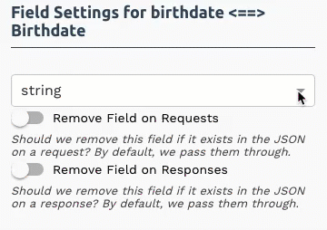
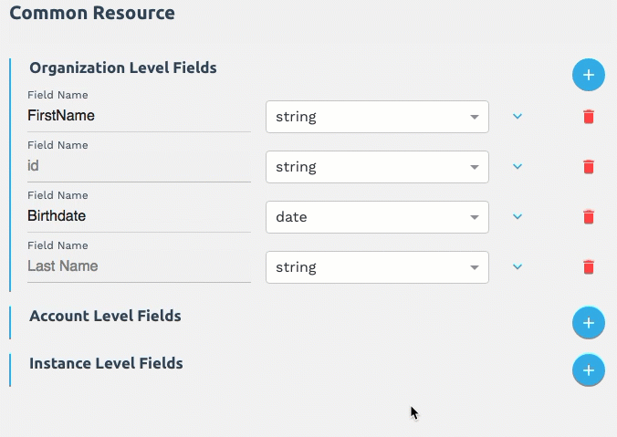

# Transforming Fields



__On this page__

* [Map Resources for Transformation](#map-resources-for-transformation)
* [Use Javascript to Manage Complex Objects](#use-javascript-to-manage-complex-objects)
* [Transforming Custom Objects](#transforming-custom-objects)
* [Transforming Data Types](#transforming-data-types)
* [Removing Fields During Transformation](#removing-fields-during-transformation)
* [Setting Default Values](#setting-default-values)
* [Testing Your Transformations](#testing-your-transformations)
* [Adding Your Common Resource to the API Docs](#adding-your-common-resource-to-the-api-docs)
* [Working With Arrays](#working-with-arrays)
* [Access Levels and Transformations](#access-levels-and-transformations)

## Select an Element Instance to Transform

After you create a common resource, the next step is to map element resource fields to the common resource to create a transformation.

To select an element instance to transform:
1. On the Transformations page, click __Create New Transformation__.

  

2. From the __Element Instances__ list, select the element instance that contains the resource that you want to use.
1. From the __Element Instance Resources__ list, select the resource that contains the fields that you want to transform.

The common resource fields on the left are ready to be mapped to the element instance resource fields on the right.

## Map Resources for Transformation

Before you can transform fields, you need to map the fields for each element instance to the common resource. The common resource fields are on the left and the element instance resource fields are on the right.

We provide a default __id__ field, which you can choose to map to an element instance ID, delete, or rename to an entirely different field. If you created you common resource based on an existing resource, you will see more fields than just the __id__ field.

You can map fields one at a time, or you can add several fields to the common resource at once, and then map them later. These instructions describe mapping a single field at a time.

This section describes mapping to a common resource at the organization level. You must be an organization level user to map to organization level fields. For more about mapping at different levels, see [Access Levels and Transformations](#access-levels-and-transformations).

To map fields:

1. On the Common Resources > Transformations page, click  __Create New Transformation__.


1. Select the Element Instance, and then select the Element Instance Resource.

    The Resources available to that Element Instance appear in the Element Instance Resources column after you select a resource.
  	

1. Beginning with the default field __id__, select a field on the right to map to __id__.


1. Click  next to the Organization Level Fields to add another field.

    __Note__:You can add fields at the account and instance level also, but these steps focus on creating an organization level common resource. For more information, see [Access Levels and Transformations](#access-levels-and-transformations).

1. Enter a name for the field, and then choose the data type if the field is something other than a string.
1. Select the corresponding field on the right to map to the new field.

    __Note__: You can type to filter.


1. Continue adding resources until you finish, and then click __Save__.
3. To map another instance, click the common resource name in the breadcrumbs at the top of the page.


### Tips

* You don't have to map fields one at a time. You can add multiple fields to the Common Resources side at once, and then map them later. Use  to show only those element instance resource fields that haven't been mapped.
* If you made a mistake and don't want to include a field in a common resource, click . If you still want the field, but want to remove the mapping, click .
* If you need to map a custom field, click , and then type a name. See [Advanced Common Resources: Transforming Custom Resources](advanced.html#transforming-custom-resources) for details.
* We use dot notation to show arrays in the element instance resources. If you need to create arrays in your common resource, use dot notation. Examples include address.city, address.state, and address.street. See [Advanced Common Resources: Working With Arrays](advanced.html#working-with-arrays) for details.

## Use Javascript to Manage Complex Objects

You can use custom Javascript when the basic object mapping does not meet your needs. For example, you might need to break a single address object into its component parts (address.city, address.state, address.street, and address.zip).



To access the custom Javascript functionality:

* Click   .

Common resource functions include the parameters and functions in the following table:

### Common Resources Custom JS Parameters and Functions

| Parameter | Description   |
| :------------- | :------------- |
| transformedObject  |  The transformed object, with any mappings already taking place.  |
| originalObject  | The original object, with no transformations or mappings taking place on it. |
| fromVendor  | Is the transformation being executed coming back from the vendor (on an API response) ? |
| done |   The callback function needed to call at the end of your JS. Call `done` to terminate a given step.  |

### Libraries

* CE: Our custom library that provides some common functionality. It is not necessary to `require` this library, it is available by default.
 * `CE.randomString()`: Generate a random string (approx. 10 characters long).
 * `CE.randomEmail()`: Generate a random email address.
 * `CE.md5(str)`: Create an MD5 hash from a string value. Takes a `string` as a parameter. Returns a `string`.
 * `CE.b64(str)`: Encode a string in base64. Takes a `string` as a parameter. Returns a `string`.
 * `CE.decode64(str)`: Decode a string from base64, using UTF-8 encoding. Takes a `string` as a parameter. Returns a `string`.
 * `CE.hmac(algo)(enc)(secret, str)`: HMAC hash a string (_str_) using the provided secret (_secret_), algorithm (_algo_), and encoding (_enc_). See https://nodejs.org/api/crypto.html#crypto_class_hmac for more information about the algorithm and encoding parameters.
 * `CE.hmac[algo][enc](secret, str)`: This is a set of convenience functions that allow HMAC hashing using some common algorithms and encodings. For example, `CE.hmacSha1Hex(secret, str)` will create an HMAC SHA1 hash of the provided string, using the provided secret, and return a hex string.  You can replace _algo_ and _enc_ with the following values:
 _algo_: `Sha1`, `Sha256`, `Md5`
 _enc_: `Hex`, `base64`
* Lodash: The popular `lodash` library. To use this library, simply `require` it in your script. It is possible to use the library modules, as well, such as `lodash/fp`.
* Util: The standard Node `util` library. To use, `require` it in your script.

### Examples

* Adding fields to a resource when a certain endpoint does not provide them:

    ```javascript
    function (originalObject, transformedObject, fromVendor, done) {
    transformedObject.isCreatedThisYear = (fromVendor && transformedObject.createdDt > '2016-01-01');
    done(transformedObject);
    }
    ```

* Two endpoints identify priority differently: one users numbers (1 or 2) and the other descriptions (low or high).

    ```javascript
    function (originalObject, transformedObject, fromVendor, done) {
    if (!fromVendor) done(transformedObject); // only care when returning data from the vendor

    transformedObject.priority = transformedObject.priorityNumber === 1 ? 'low' : 'high'; // we prefer our priority to be the string representation, so we convert the endpoints "priorityNumber" field to the appropriate string representation here.

    done(transformedObject);
  }
    ```

* Combining FirstName and LastName fields.

```javascript
function (originalObject, transformedObject, fromVendor, done) {
if transformedObject.Name = originalObject.FirstName + '  ' + originalObject.LastName;
done(transformedObject);
}
```

## Transforming Custom Objects

If you do not see an object that you expect in the instance resources, you can still map it by entering the object name. This sometime happens for custom objects you created at the endpoint.

To map a custom object:

1. Click .

    The list becomes a text entry field.

1. In __Field Name__, enter the name of the object.

    


## Removing Fields During Transformation

Cloud Elements passes through all fields in the JSON on both requests and responses. However, you can choose to remove all unmapped fields or specific fields from requests or responses.

To remove unmapped fields:

1. On the Transformations page, click .
1. Switch __Remove Unmapped Fields__ to on.
1. Click __Save__.

To remove fields from requests or responses:

1. On the Transformations page, click .
1. Switch on or off the sliders for the requests or responses.

    For example, in the following configuration, we remove the portal-id field from the response.
    

## Transforming Data Types

You can transform the data types on vendor objects. In most cases, you only need to select a new data type, but for dates you also provide a mask, or date format.

To change data types:

1. On the Transformations page, click .
2. Select a type from the list.
3. If you select date, add a date format to the Date Mask.




## Setting Default Values

If no values exist for a specific field, but you do not want to remove it, you can set a default value.

To set a default value:

1. On the Transformations page, click .
1. Click __Default Value__, and then type the value.
1. Click __Save__.

## Testing Your Transformations

After you set up your mapping, you can test your transformations.

To test a transformation:

1. On the Transformations page, click .
1. Review the transformed response body. This is the response containing only the fields in your common resource.
1. Click __Original__ to see the entire response JSON payload.
1. Test a Put or Patch by selecting the appropriate method, and then entering the JSON request.

    __Tip__: Copy the JSON payload from Transformed.

1. Click __Run__.

## Adding Your Common Resource to the API Docs

You can add the common resource you create to the instances of each affected element.

To add a common resource to API docs:

1. On the Transformations page, click .
1. Switch __Add to API Docs__ on.
1. Click __Save__.

Try it out:

1. Go to an element instance.
1. Hover over the instance card, and the click __API Docs__.
1. Scroll to your common resource.

The list of resources is in alphabetical order, so the example myContact in this guide is after the `leads` resource:


## Working with Nested Objects

We display object arrays in dot notation. You can also use dot notation to nest objects in your common resource. For example, you might want to create nested address fields like those shown in the example below:


The JSON result of this nested object:

```json
{
  "Address": {
    "city": "Cambridge",
    "state": "MA",
    "street":"1234567 Elm St",
    "zip":"99999"
  }
}
```

## Access Levels and Transformations

You can map fields at different levels depending on your access. Organization level users can map at any level, while other users can map only at the instance level.

To map fields at the account level (organization level users only):

* Click  by the level of fields that you want to map.

To move mapping between levels:

* Click the arrow next to the fields to move the fields between levels.

    
